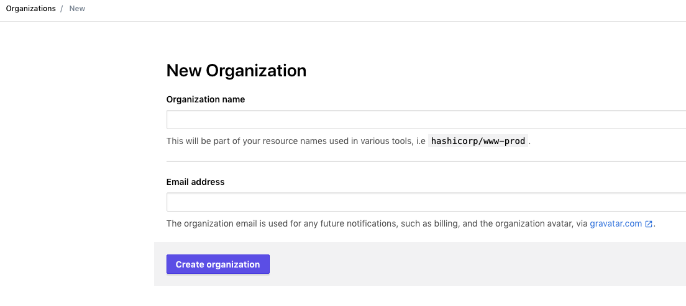
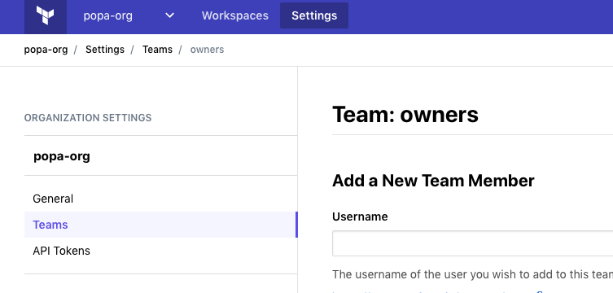

# playground-tf-remote-state
TF remote state example

# Pre-requisites 

- install [git](https://git-scm.com/downloads)
- install [Terraform](https://learn.hashicorp.com/terraform/getting-started/install.html)

## clone repository to use it
```
git clone git@github.com:andrewpopa/playground-tf-remote-state.git
cd playground-tf-remote-state
```

## usage
```
terraform init
terraform plan
terraform apply
```

# configure remote state

## create org in https://app.terraform.io


## generate new token to access tf remote
Settings -> Teams



## add this token to local config
```bash
$ cat .terraformrc
credentials "app.terraform.io" {
  token = "TF-API-TOKEN"
}
```

## configure remote state

configure [remote](https://www.terraform.io/docs/backends/types/remote.html) backend  

## re-run `terraform init`

```bash
$ terraform init

Initializing the backend...
Do you want to copy existing state to the new backend?
  Pre-existing state was found while migrating the previous "local" backend to the
  newly configured "remote" backend. No existing state was found in the newly
  configured "remote" backend. Do you want to copy this state to the new "remote"
  backend? Enter "yes" to copy and "no" to start with an empty state.

  Enter a value: yes


Successfully configured the backend "remote"! Terraform will automatically
use this backend unless the backend configuration changes.
```

Enjoy!